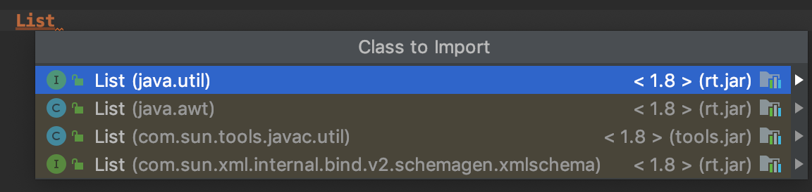

# Hello, World! Deconstructed

Have you ever tried writing out a standalone "Hello, World!" program in Java, away from an IDE, and instead on a piece of paper or a whiteboard? Go ahead and give it a go if you've never done it before. Go on. I dare you, I double dare you m... (you know what, I'm going to spare you the rest of the Pulp Fiction quote!) Writing it out by hand turns out to be quite a good bit of practice if you're new to Java. Furthermore, making sure you understand each and every term in this simple program is very important if you wish to use Java, as they lay the foundation for much of the concepts you will see in pretty much every Java program out there. Let's get stuck in and see if we can deconstruct each term in a meaningful manner, but also realise that there is a lot going on that you probably take for granted as well. Let's start by taking a look at the program as a whole:

```java
public class HelloWorld {
    public static void main(String[] args) {
        System.out.println("Hello, World!");
    }
}
```

We can ennumerate and annotate each term to make reffering to the components more obvious:


It's often noted that Java is overly verbose and is composed by a lot of `boilerplate` code, that is to say, template-like code that must be included for the desired code to run. In this example, the first two lines are boilerplate as they are not directly concerned with what we want to achieve - which is to simply display the phrase "Hello, World!" to the person operating the computer, which is what the third line does. Part of the reason for this level of verbosity is due to the fact that Java is forcing you to adopt the `Object Oriented Programming` paradigm, in which a program seeks to represent the real-world as a set of `objects`.

## Term 2: `class`

This is a good point to discuss the second term `class`. `class` is a reserved keyword in Java, and like all other reserved keywords, it must start with a lower case letter, but more importantly: it has a very specific purpose. A `class` serves as a blueprint for creating `objects`, and it will define their features (`attributes`) and what they can do (`behaviour`). To make a `class`, all we have to do is write the keyword `class` followed by the name of the class, and then we can add the attributes and behaviour inside the code-block which is contained within the curly brackets. Here are two examples:

```java
class Frog {

}
```

```java
class Fly {

}
```
We've just made a `Frog class` and a `Fly class`! Notice the initial capital letter - another Java naming convention that we must adhere to for class names. Also notice that the words used for classes should be nouns, as they describe either a person, entity, thing, or idea. You can work out from this that in our main example, we have a `class` called `HelloWorld`, indicated by the third term. In fact, not only is the class called `HelloWorld`, the file that this bit of code lives in **HAS** to be called `HelloWorld.java`. We'll see in a moment exactly why this has to be the case for our example, but typically, each file will just have one class in it, and the name of the file and the class must be the same (of course, the file will also include the .java extension). So with our `Frog` and `Fly` classes, the file and class structure will look like this:
```java
+---Frog.java--------+     +---Fly.java------------------+
|                    |     |                             |
|  class Frog {      |     |  class Fly {                |
|      int eyes = 2; |     |      void iritateHuman() {  |
|                    |     |                             |
|  }                 |     |      }                      |
|                    |     |  }                          |
|                    |     |                             |
+--------------------+     +-----------------------------+
```
I've taken the liberty to give the `Frog` the attribute of two `eyes`, and I've given the `Fly` the `iritateHuman()` (sic) behaviour. So you see how each class is contained in it's own file, and the class and filename are the same. This is useful because it keeps everything that is specific to the `Frog` in one place, and everything that is specific to the `Fly` in it's own place, which can help us out in the long run by making our overall program more navigatable and readable. This concept is refered to as `encapsulation`, allowing these related ideas to be put together into one unit.

This image shows multiple levels of encapsulation: the powered medicine is encapsulated in the pill, and the pills are encapsulated in the pill bottle - the encapsulation helps keep the things that belong together together.

## Term 1: `public`

Classes provide an opportunity to bring together all the low-level components (the attributes and behaviour) that **should** fit together. Sometimes we'll want to permit these low-level components to have inter-class communication, and sometimes we'll want to restrict this.

The first term in our main example is where things get a little trickier. A class has an `access modifier`, which in our case is `public`. Besides the `public` modifier, there is also `private`, `protected` and the `package-private` modifier. This last one is the default modifier, that is to say that when you don't add any of the other modifier keywords, then the class is automatically designated as `package-private`, which is what the example `Frog` class above is. These access modifiers apply not only to classes, but also to methods, constructors and data members.


[credit](https://stackoverflow.com/a/215505)

#### 1. `public` access modifier

The access modifier `public` is fairly self-descriptive in that it makes the class publicly availiable to other classes.

An important thing to note is that a file may only have one `public class`. So it's OK to have other classes in the file, just as long as they have a different access modifier, which means I can put in a `private` class called `FrogFeed` in the same file as the `Frog`:
```java
+---Frog.java---------------+
|                           |
|  public class Frog {      |
|  }                        |
|                           |
|  private class FrogFeed { |
|  }                        |
+---------------------------+
```
#### 2. `protected` access modifier

The `protected` acces modifier can't actually be applied to classes, but it can be used with methods, constructors and data members, so we'll look at it here, and start by understanding how we organise classes in packages and files.

The way we organise our classes is through files, packages and folders. We've already seen how .java files contain the classes, and you're probably familiar with folders (or directories) because your computer's Operating System uses these to create a hierarchy for storing files. Packages are exactly the same as folders, with the only difference being that they are the folders within the `src` folder:
```java
Documents
└── pizzeria                                <- folder
    └── src                                 <- folder
        └── com                             <- package
            └── example                     <- package
                ├── appliances              <- package
                │   ├── Oven.java
                │   └── Refrigerator.java
                ├── food                    <- package
                │   ├── Antipasti.java
                │   ├── Pasta.java
                │   ├── Pizza.java
                │   └── ingredients         <- package
                │       ├── Cheese.java
                │       ├── Flour.java
                │       └── Tomato.java
                └── restaurant              <- package
                    ├── Kitchen.java
                    └── Toilet.java
```
Packages are used for organising related classes, and to put a class in a package, you need to add the line

`package `*packagename*`;`

as the very first instruction in the source file. Typically you will see these in a format that has one or more identifiers separated by periods such as `java.util.random`. The naming format here is trying to make sure that each name is unique, so as to avoid namespace collisions and is the same as with import naming. For example, if I wanted to make use of the class `List`, I would find that there are quite a few:

*which one do I want?* I have to specify, and this reversed naming format helps keep all of these classes and packages separate.

When the `protected` access modifier is used, it signals that the method, constructors or data member is accessible both within and outside the package but through inheritance only.

#### 3. `package private` access modifier

When no named package statements are included in a source file, then the classes will be placed in the *default package*. The default modifier is accessible only within package.

```java
    ├── food                    <- package
    │   ├── Antipasti.java
    │   ├── Pasta.java
    │   ├── Pizza.java
    │   └── ingredients         <- package
    │       ├── Cheese.java
    │       ├── Flour.java
    │       └── Tomato.java
```

If all the classes in the above situation were given the `package private` access modifier, then the class, field, method or constructor of the food package (Antipasti, Pasta and Pizza classe) would have no accessiblity to the class, field, method or constructor of the ingredients package (Cheese, Flour and Tomato classes).

#### 4. `private` access modifier

The `private` access modifier gives us the uportunity to permit or deny the linking of low-level components with each other, and is more often found on fields and methods, rather than on classes. A field or method that is marked as private will only allow code inside the same class to access the field, or call the method - it keeps everything very contained in the class. This means that code inside subclasses or external classes cannot access the fields or methods that are designated as `private`.

```java
+-----------------TronaldDump.java-----------------+
|                                                  |
|    private String thoughts = "";                 |
|                                                  |
|    public String getThoughts() {                 |
|        return thoughts;                          |
|    }                                             |
|                                                  |
|    public void setThoughts(String thoughts) {    |
|        this.thoughts = thoughts;                 |
|    }                                             |
|                                                  |
+--------------------------------------------------+
```

- TODO: getters and setters

- TODO: reason for encapsulation
- encapsulation: hide the implementation details from users.

Note that you can't make your Main class private as it would render it inaccessible, preventing the program from having an entrypoint and making it unuseable.

## Term 3: The name of the class

As mentioned above, the name of a class should be a descriptive noun, and should follow the naming conventions by being in CamelCase, therefore `HelloWorld` is a `valid Java qualified name`. When a class is `public` then we know that the name of the class **must** be the same as the filename.

## Term 4: Access modifier

We've seen the `public` access modifier applied to a class, but it can also be applied to fields and methods, as is the case here.

## Term 5: The `Static` keyword

The term `static` indicates that the method belongs to the class. This means that an instance of the object does not need to be created in order to run that method or access the static variables.

## Term 6: The `return type`

The Java Virtual Machine (JVM) is the underlying entity on your computer that converts Java code into something meaningful that your computer can understand and run. One of the first steps in converting the source code into byte code and from that into machine code is compilation. The JVM needs to compile the source code, and in order to make head and tails of your code when it's compiling it needs to know the type of every variable or object during this process. For this reason, we say that Java is a `statically typed` programming language. We call upon methods to perform some kind of action or logical process, and, apart from the `void` type, the method will `return` a value or object. In the case of this main method, we are not making use of a returned value or object, but instead using a print of the screen to the console as a side-effect. We can summarise by saying that `void` is the absence of a return type.

## Term 7: The `main` method

 In order to run a program, the JVM requires an entry point, or starting point. The `main` method is the entry point for this Java program. You would not be able to start the HelloWorld program if you renamed this method to anything other that `main` - it is that crucial for the JVM.

## Term 8: The `argument type`

The `main` method accepts a single argument and in this particular case, the `type` of the `args` is an array of String. This `String[] args` is a mechanism that allows us to pass runtime information to the program, and we also refer to this as the command line arguments. We can access the different indicies of the array with the `arrayName[arrayIndex]` syntax. I've modified the original HelloWorld program to demonstrate some simple uses of String arrays:
```java
import java.util.Arrays;

public class HelloWorld {
    public static void main(String[] args) {
        HelloWorld helloWorld = new HelloWorld();
        helloWorld.arrayDemonstrator();
    }

    private void arrayDemonstrator() {
        String[] contents = new String[]{"Hello", "World"};
        System.out.println("The contents of contents is: " + Arrays.toString(contents));
        System.out.println("The length of contents is: " + contents.length);
        System.out.println("The zeroth index of contents is: " + contents[0]);
    }
}
```
Which will print out:
```
The contents of args is: [Hello, World]
The length of args is: 2
The zeroth index of args is: Hello
```

## Term 9: The `argument variable`

This `args` argument variable must be included as boilerplate, even though it isn't used within the method body. If we wanted to pass something into our program from an external location, and have the program use it, then we would need to modify the code, for example if we used the `program arguments` `John Smith` with the following code:
```java
import java.util.Arrays;

public class HelloWorld {
    public static void main(String[] args) {
        System.out.println("Hello " + args[0] + " " + args[1]);
        System.out.println("The args array contains: "+ Arrays.toString(args));
    }
}
```
it would would output:
```
Hello John Smith
The args array contains: [John, Smith]
```

In order to pass in your own program arguments with an IDE (here shown with IntelliJ), update your `program arguments` in the "edit configurations..." window:


## Term 10: The class `System`

Next we look at `System.out.println()`, which can be broken into 3 parts. `System` is a class (a clue for why this is the case comes from the naming convention that states that all classes should start with a capital letter) that is automatically included into all Java projects, and it belongs to the package called `java.lang`. It turns out that there are three packages that are automatically imported into a Java project: First, the package with no name. Second, the `java.lang` package. And third, the current package (the package in which the current file is defined). Furthermore, System is a `final` class, which prevents inheritance and means that this class cannot be used as a base class to derive other classes. The `System` class provides many facilities such as standard input, standard output, and error output streams; access to externally defined properties and environment and a means of loading files and libraries.

## Term 11: The field `out`

`out` is a `field` of type PrintStream declared in the System class. The declaration for this field explains that:
```java
 /**
     * The "standard" output stream. This stream is already
     * open and ready to accept output data. Typically this stream
     * corresponds to display output or another output destination
     * specified by the host environment or user.
     * For simple stand-alone Java applications, a typical way to write
     * a line of output data is:
     *     System.out.println(data)
     */
    public final static PrintStream out = null;
```
So, `out` will form a connection that directs data that we wish to display to the displayed location in the application, such as IDE or command line.

## Term 12: The method `println()`

`println()` is a `method`, this can be easily spotted because all methods have `()` parenthesis behind the method name. `println()` is a method of the `PrintStream` class:
```java
class System {
    public static final PrintStream out;
    //...
}
```
the `Prinstream` class belongs to `java.io` package:
```java
class PrintStream{
    public void println();
    //...
}
```
The purpose of `println("...")` is to print the string "..." and then to move the cursor to a new line.

## Term 13: The string `"Hello, World!"`
We've finally got here - this is the actual part of the program that we wanted to see all along, and ut took all the rest of the code to get us here. In Java, a `String` (notice the initial capital letter) is an `object` rather than a `primitive` (such as `int`, `boolean` and `double`), and is so commonly used that it's a little special. One thing that makes it special is that it's `immutable`, which means that once it has been created, a String object cannot be change. Normally, `objects` need to be instantiated in this way
```java
Frog frog = new Frog();
```
but with Strings, this is not neccessary (you can instantiate them like the above way, but that is rarely done), instead we can assign a String like this:
```java
String variableName = "The String we want to store";
```
If you look at the `declaration` of the String class, you can see that under the hood, the implementation of a String is done using an array of characters, and that String objects have many methods available that the primitives do not have:
```java
public final class String
    implements java.io.Serializable, Comparable<String>, CharSequence {
    /** The value is used for character storage. */
    private final char value[];
    ...
```

## Running the program

So how do we run this program from the command line? The first step is to compile the program, which is done using the command `javac` followed by the name of the file we wish to compile. Upon successful compilation, we may run the program using the `java` command, followed by the name of the program we just compiled (no extension required this time):

```sh
$ javac HelloWorld.java

$ java HelloWorld
Hello, World!
```

Goodbye, World!
